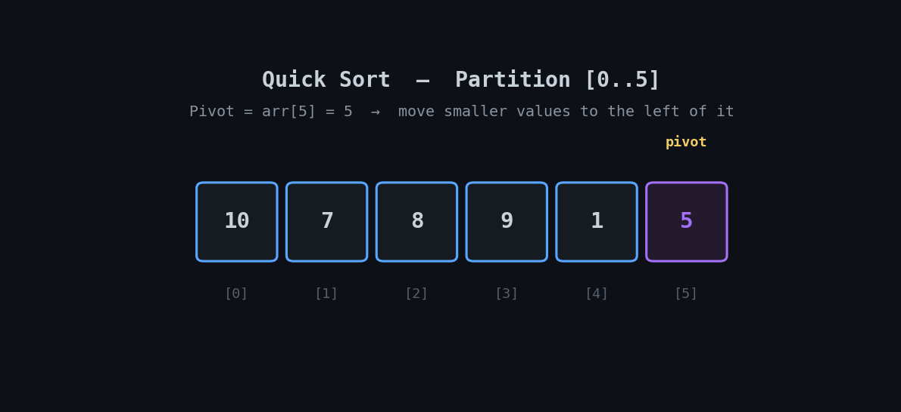

  <h1 align="center">⚡ Quick Sort</h1>

<p align="center">
  <i>An animated, beginner-friendly walkthrough of the Quick Sort algorithm (Lomuto partition scheme) with a clean Python implementation.</i>
</p>

<p align="center">
  
  
  
</p>

---

## 📽️ Visual Walkthrough

Quick Sort is a **divide-and-conquer** algorithm: it picks a **pivot**, partitions the array so everything smaller than the pivot ends up on its left and everything larger ends up on its right, then recursively sorts each side. Once a pivot is placed, it's in its **final sorted position** for good.

<p align="center">
  
</p>

> 🔵 Blue = active partition range · 🟣 Purple = pivot · 🟡 Amber = comparing, no swap · 🟠 Orange = swap happening · 🟢 Green = pivot locked in final position

---

## ⚙️ How It Works

1. Choose the **last element** of the current range as the pivot.
2. Walk through the range, moving every element `≤ pivot` to the left side (tracked with pointer `i`).
3. After the walk, swap the pivot into position `i + 1` — this is now its correct, final sorted position.
4. Recursively apply the same process to the sub-range **left** of the pivot, then the sub-range **right** of the pivot.

---

## ⏱️ Complexity

| Case | Time | Space |
|---|---|---|
| Best | `O(n log n)` | `O(log n)` |
| Average | `O(n log n)` | `O(log n)` |
| Worst (already sorted / bad pivot choices) | `O(n²)` | `O(log n)` |

Quick Sort's worst case happens when the pivot is repeatedly the smallest or largest element (e.g. an already-sorted array with last-element pivoting) — each partition only shrinks the problem by one element instead of roughly halving it. In practice, average-case performance is excellent, which is why Quick Sort is a common default sorting choice.

---

## 🐍 Implementation

```python
def partition(arr, low, high):
    pivot = arr[high]      # choose last element as pivot
    i = low - 1            # pointer for smaller element

    for j in range(low, high):  # traverse from low to high-1
        if arr[j] <= pivot:     # if current element <= pivot
            i += 1
            arr[i], arr[j] = arr[j], arr[i]  # swap

    # place pivot in correct position
    arr[i + 1], arr[high] = arr[high], arr[i + 1]
    return i + 1


def quick_sort(arr, low, high):
    if low < high:
        pivot_index = partition(arr, low, high)  # partition index
        quick_sort(arr, low, pivot_index - 1)    # sort left
        quick_sort(arr, pivot_index + 1, high)   # sort right


# Example
arr = [10, 7, 8, 9, 1, 5]
print("Original:", arr)
quick_sort(arr, 0, len(arr) - 1)
print("Sorted:", arr)
```

> 💡 Full file: [`quick_sort.py`](./quick_sort.py)

---

## ▶️ Run It

```bash
git clone https://github.com/zain-cs/10-Quick-Sort.git
cd 10-Quick-Sort
python quick_sort.py
```

---

## 🔁 Quick Sort vs. Merge Sort

| | Merge Sort | Quick Sort |
|---|---|---|
| Time complexity | `O(n log n)` always | `O(n log n)` average, `O(n²)` worst |
| Space complexity | `O(n)` — needs extra arrays | `O(log n)` — sorts in place |
| Stable? | ✅ Yes | ❌ No |
| In practice | Predictable, guaranteed | Usually faster due to lower overhead and in-place sorting |

Both are divide-and-conquer, but Quick Sort trades Merge Sort's worst-case guarantee for better average-case speed and lower memory use — which is why it's often the default choice in real-world sorting libraries for general-purpose use.

---

## 🗺️ Part of a DSA Series

📌 [Linear Search](https://github.com/zain-cs/1-Linear-Search) → [Binary Search](https://github.com/zain-cs/2-Binary-Search) → [Ternary Search](https://github.com/zain-cs/3-Ternary-Search) → [Jump Search](https://github.com/zain-cs/4-Jump-Search) → [Exponential Search](https://github.com/zain-cs/5-Exponential-Search) → [Bubble Sort](https://github.com/zain-cs/6-Bubble-Sort) → [Selection Sort](https://github.com/zain-cs/7-Selection-Sort) → [Insertion Sort](https://github.com/zain-cs/8-Insertion-Sort) → [Merge Sort](https://github.com/zain-cs/9-Merge-Sort) → **Quick Sort** → more to come as I work through DSA.

---

<p align="center">
  Made with 🐍 by <a href="https://github.com/zain-cs">Muhammad Zain Ul Abidin</a>
</p>
